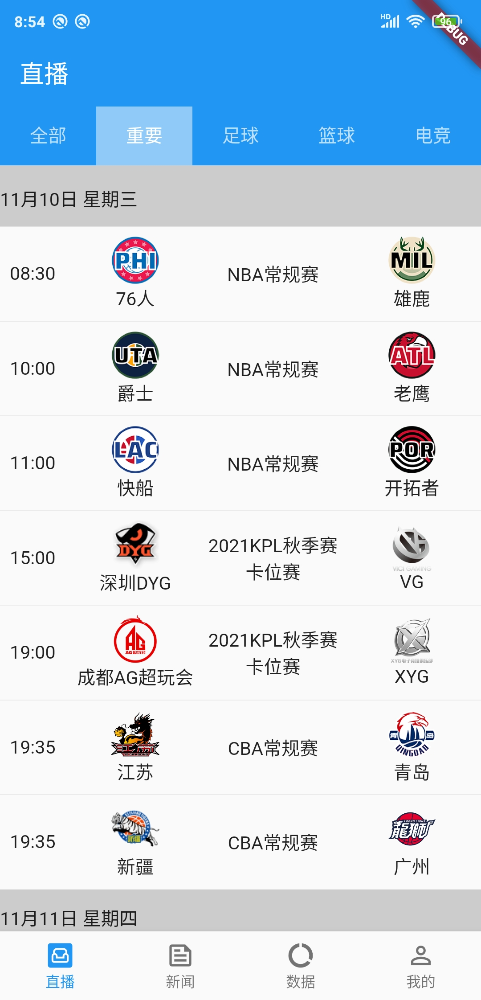

# Sports Complete

项目为体育相关的直播和数据App，数据来源是 www.zhibo8.cc 。

**项目持续维护中，欢迎Star、Fork，提Issue。**

## 预览

||||
|---|---|---|

**划重点，中国男足排名75。**

## 开发环境

1. Flutter 2.5.3 • channel stable
2. Dart 2.14.4

## 已实现功能

* FIFA，男女足世界排名。
* 深色模式切换。
* 所有联赛和项目的赛程。

## 下一步计划

* [ ] NBA文字直播和数据统计。

## 第三方库

|库|描述|
|---|---|
|[dio](https://pub.dev/packages/dio)|网络请求|
|[equatable](https://pub.dev/packages/equatable)|对象比较|
|[flutter_bloc](https://pub.dev/packages/flutter_bloc)|状态管理|
|[fluttertoast](https://pub.dev/packages/fluttertoast)|Toast|
|[scrollable_positioned_list](https://pub.dev/packages/scrollable_positioned_list)|列表滚动到指定widget|
|[sticky_headers](https://pub.dev/packages/sticky_headers)|粘性头部|

